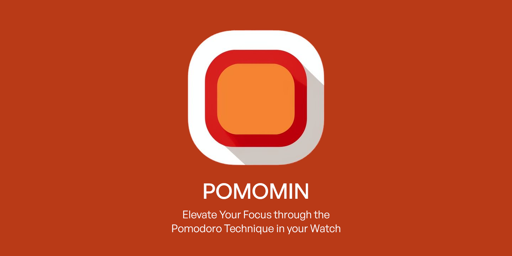

# PomoMin - Pomodoro Timer for Garmin Watches

---
Welcome to PomoMin, a Pomodoro timer seamlessly integrated with Garmin watches. This application is designed to enhance focus and productivity through precise timing, incorporating the proven Pomodoro technique into your workflow.

## Features

- **Effortless Pomodoro Technique:** PomoMin simplifies the Pomodoro technique with two focused intervals—25 minutes of work and a 5-minute break.
- **Seamless Garmin Integration:** Enjoy precision timing on your wrist with seamless integration with Garmin watches.

## What's Coming Next

In future updates, anticipate an evolution of PomoMin with expanded intervals and customizable configuration options, tailored to meet the diverse needs of your work routine.

## Installation

To install PomoMin on your Garmin watch, you would typically follow these steps:

1. Install the Garmin Connect IQ app on your smartphone if you haven't already.
2. Download the PomoMin app from the Garmin Connect IQ store.
3. Sync your Garmin watch with the Garmin Connect IQ app.

Please note that these steps might vary slightly depending on the specific model of your Garmin watch and the version of the Garmin Connect IQ app that you are using.

## Contact

I welcome your valuable suggestions and comments to enhance your PomoMin experience. Reach out to me at chavinvan@gmail.com.